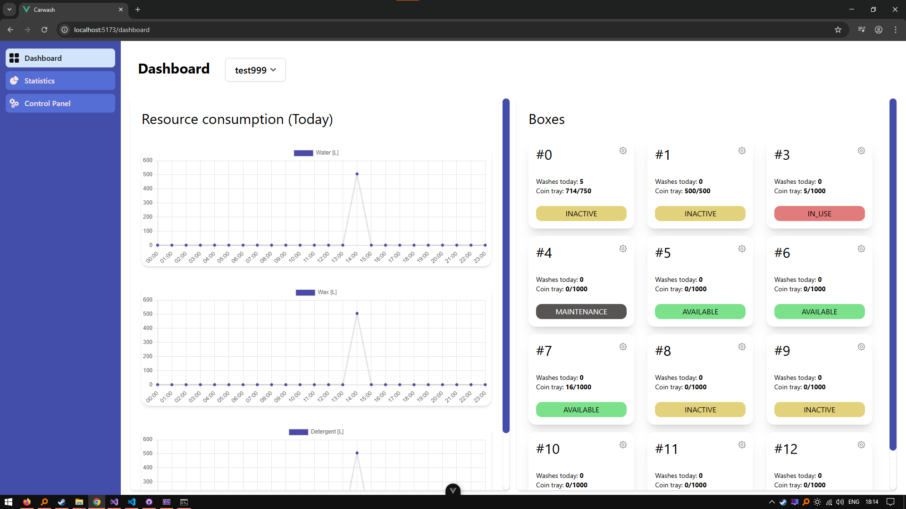
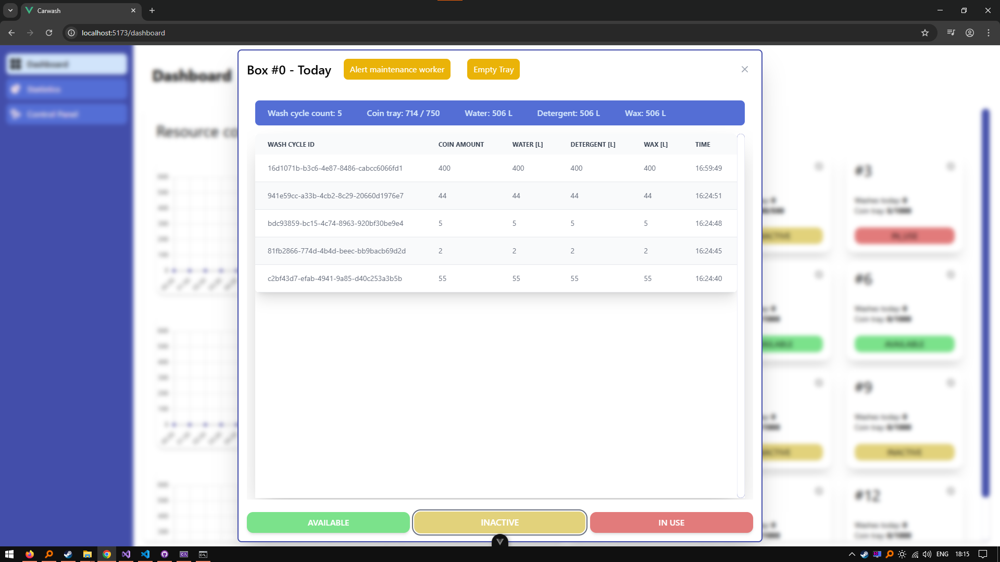
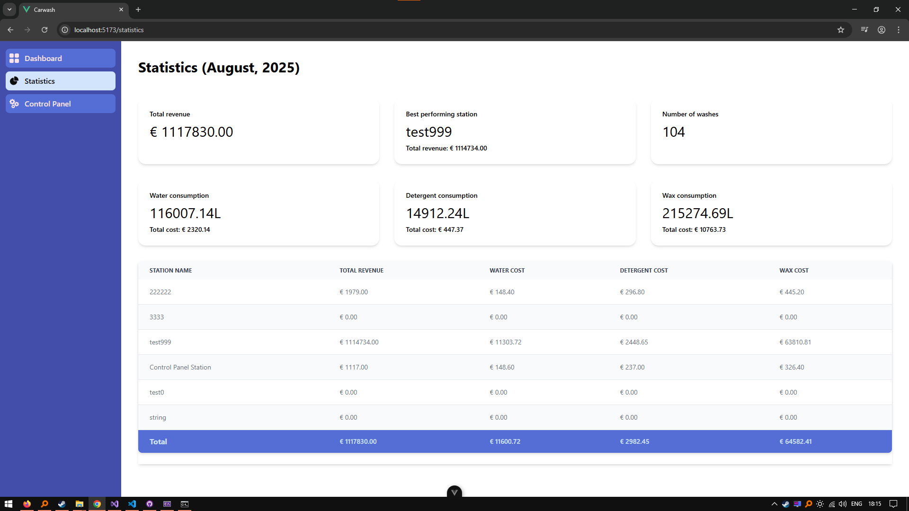
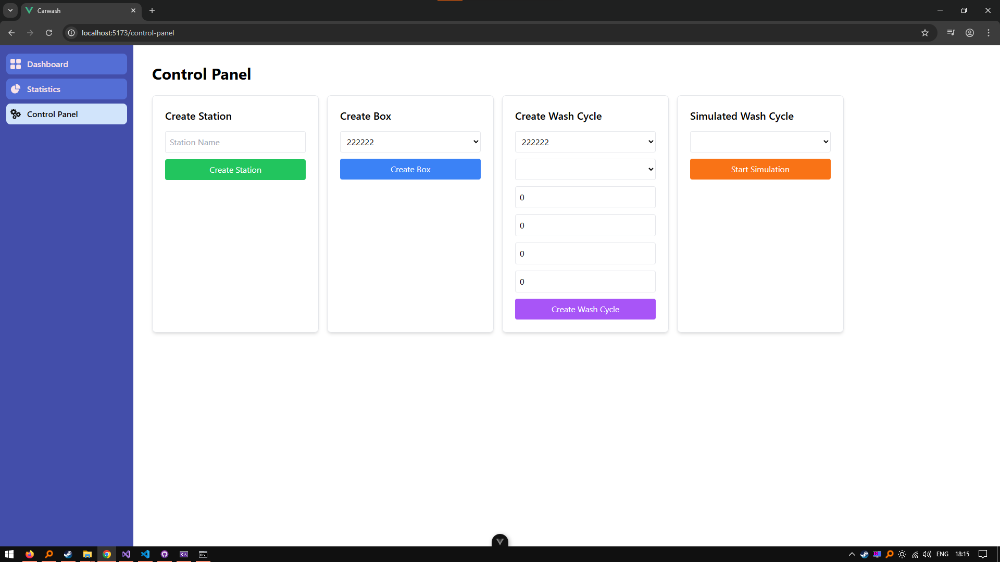

## Carwash Monitor

### About

Carwash Monitor is a full-stack application developed as a final thesis for a Bachelor's degree. It enables monitoring and managing carwash operations efficiently.

### Features

- Real-time status monitoring of carwash stations
- User-friendly dashboard built with Vue.js
- Backend API developed in C# .NET Core

### Setup

1. Install dependencies

    - .NET 10.0 SDK
    - npm

    The database is SQLite — no server to install. A `carwash.db` file is created on first run inside `carwash-backend/`.

2. Clone the repository

```bash
git clone https://github.com/milardich/carwash-monitor.git
```
3. run `run.bat` from the carwash-monitor root directory and let it finish (~15 seconds)

4. Open `http://localhost:4173/` in your browser

### Screenshots



